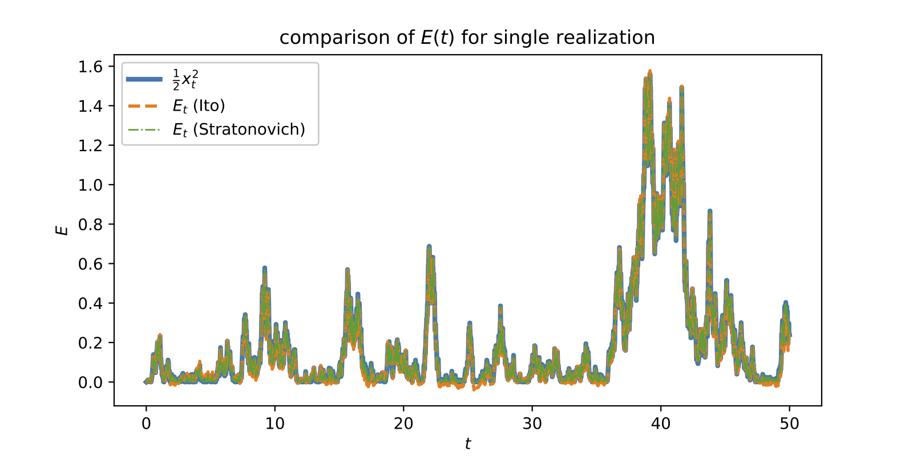
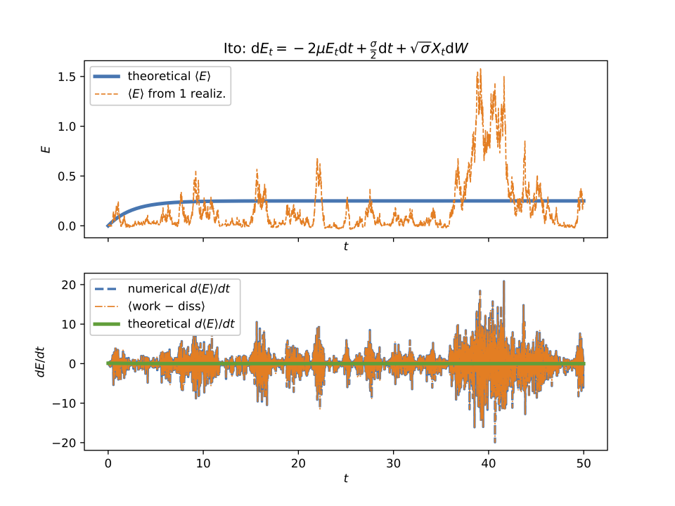
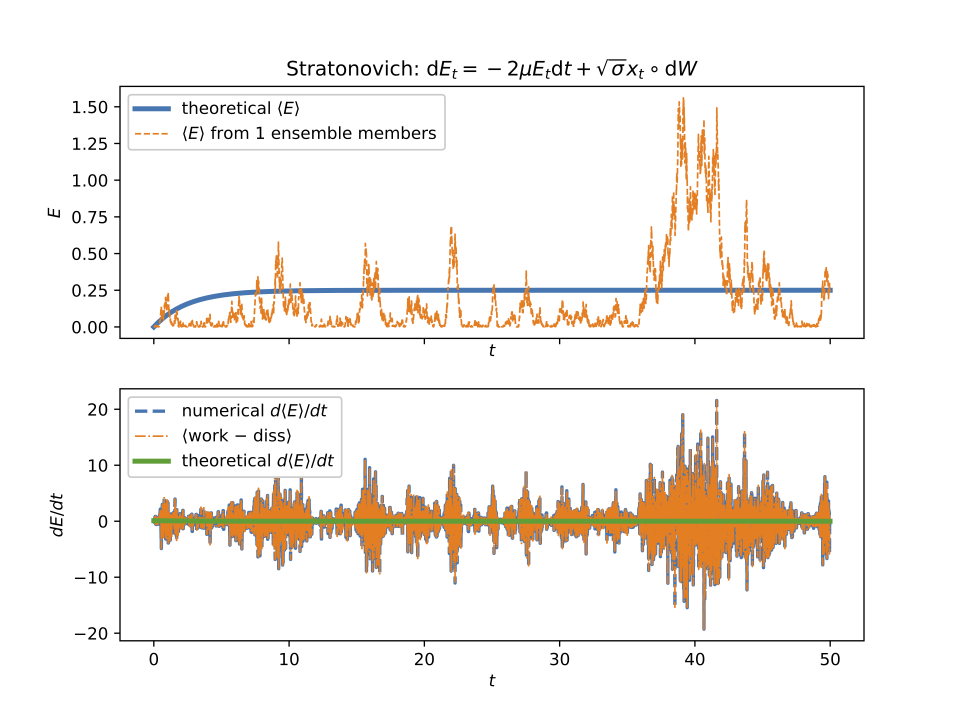
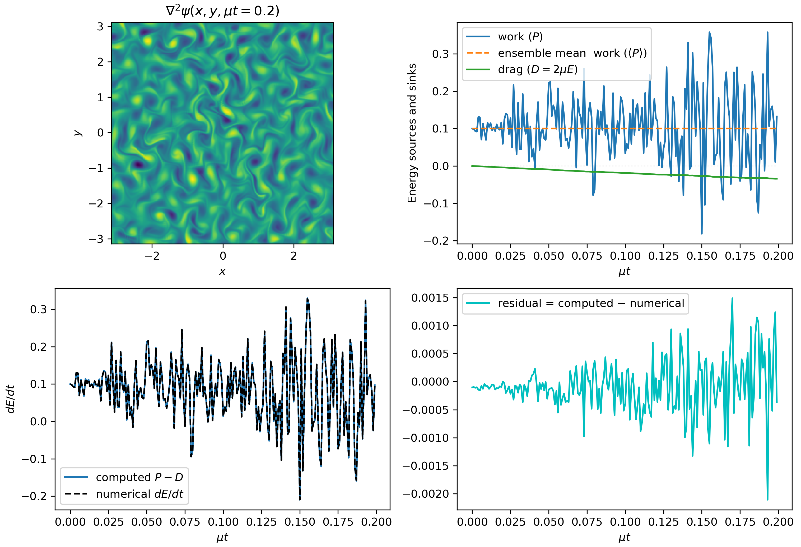

# Forcing

The code implements forcing in various modules (currently in `TwoDTurb` and `BarotropicQG`). Forcing can be either
deterministic or stochastic (random). For deterministic forcing the implementation is straightforward; for stochastic
forcing there are two main train of thoughts: Itô calculus and Stratonovich calculus.

Both stochastic calculi give the same results. But once we decide to use one of the two calculi we have to remain
consistent and use that calculus for everywhere. There is a lot of confusion and mostly the confusion stems from not
using the same stochastic calculus consistently throughout the computation but rather interchanging between the two.

`FourierFlows` uses Stratonovich calculus throughout the code. This choise was made because Stratonovich calculus
works the same with both stochastic and deterministic forcing, i.e. with Stratonovich calculus we have the same
chain rules for differentiation for stochastic functions as the chain rules we learn in normal-deterministic calculus).
Therefore, the code written as is does not really "care" of what forcing the user implements.

If you are interested in learning more regarding the two stochastic calculi and how they are numerically
implemented then read on; otherwise you can skip this section of the documentation and go to the Module Tutorials.

## Stochastic Differential Equations (SDEs)

A differential equation in the form:

```math
	\frac{\mathrm{d} x}{\mathrm{d} t} = f(x),\quad x(t_0)=0,
```

can also be written in an integral form:

```math
	x(t) = \int_{t_0}^{t} f(x(s))\,\mathrm{d} s.
```

In a similar manner, a stochastic differential equation

```math
	\mathrm{d} x = f(x)\,\mathrm{d} t + g(x)\,\mathrm{d} W_t,\quad x(t_0)=0,
```

with $\mathrm{d} W_t$ a white-noise process, can be written in an integral form as:

```math
	x(t) = \int_{t_0}^{t} f(x(s))\,\mathrm{d} s + \int_{t_0}^{t} g(x(s))\,\mathrm{d} W_s .
```

Of course now, the last integral is a stochastic integral and there is not a single straight-forward way of
computing it --- there are a lot of different ways we can approximate it as a Riemannian sum and each of them
leads to a different answer. The two most popular ways for computing such stochastic integrals are:

```math
{\color{Green}\text{Itô}: \int_{t_0}^{t} g(x(s))\,\mathrm{d} W_s\approx\sum_{j} g\left(x(t_j)\right)(W_{j+1}-W_j)},\\
{\color{Magenta}\text{Stratonovich}: \int_{t_0}^{t} g(x(s))\,\mathrm{d} W_s \approx \sum_{j} g\left(x\left(\tfrac{1}{2}(t_j+t_{j+1})\right)\right)(W_{j+1}-W_j)}.
```

Because the white noise process is not continuous the two definitions do not converge to the same result; the two
definitions give thoroughly different results. And to overcome that they come along with different chain rules,
i.e., chain rules that are not necessarily the same as those in plain old calculus.

An SDE can be written also in differential form. Because we cannot formally form $\mathrm{d} W/\mathrm{d} t$, since $W$ is
nowhere differentiable, we write an SDE in differential form as:

```math
{\color{Green}\text{Itô}: \mathrm{d} x_t = f(x_t)\mathrm{d} t + g(x_t)\mathrm{d} W_t},\\
{\color{Magenta}\text{Stratonovich}: \mathrm{d} x_t = f(x_t) \mathrm{d} t + g(x_t) \circ \mathrm{d} W_t}.
```

The circle in $g(x_t)\circ\mathrm{d} W_t$ is used to differentiate between Itô or Stratonovich calculus.

A variable change $y=G(x)$ is done as follows according to the two different calculi:

```math
{\color{Green}\text{Itô}: \mathrm{d} y_t = \frac{\mathrm{d} G}{\mathrm{d} x}\mathrm{d} x_t + \tfrac{1}{2} g(x_t)^2 \frac{\mathrm{d}^2 G}{\mathrm{d} x^2}\mathrm{d} t =\left[ \frac{\mathrm{d} G}{\mathrm{d} x}f(x_t) + \tfrac{1}{2} g(x_t)^2 \frac{\mathrm{d}^2 G}{\mathrm{d} x^2}\right]\mathrm{d} t + \frac{\mathrm{d} G}{\mathrm{d} x}g(x_t)\mathrm{d} W_t},\\
{\color{Magenta}\text{Stratonovich}: \mathrm{d} y_t  = \frac{\mathrm{d} G}{\mathrm{d} x}\mathrm{d} x_t =\frac{\mathrm{d} G}{\mathrm{d} x} f(x_t) \mathrm{d} t + \frac{\mathrm{d} G}{\mathrm{d} x}g(x_t)\circ\mathrm{d} W_t}.
```

The above are the so called *stochastic chain rules*. All derivatives of $G$ are evaluated at $x_t$.

It's easy to see that the extra drift-term in Itô's interpretation of the stochastic integral,
i.e., ${\color{Green}\tfrac{1}{2} g^2\, \mathrm{d}^2G/\mathrm{d} x^2}$  is *exactly* equal to the ensemble mean of the
Stratonovich stochastic integral. That's because the Itô stochastic integral has, by construction,
zero ensemble mean since at every instant the noise is multiplied with $g$ evaluated before the action of the
noise; $g$ and $\mathrm{d} W$ are uncorrelated and thus:

```math
{\color{Green}\left\langle g(x_t)\mathrm{d} W_t \right\rangle =0}\quad\text{while}\quad {\color{Magenta}\left\langle g(x_t)\circ\mathrm{d} W_t \right\rangle \ne 0}.
```

The above is demonstrated by evaluating the simple stochastic integral:

```math
{\color{Green}\text{Itô}: \left\langle \int_{t_0}^{t} W_s\,\mathrm{d} W_s \right\rangle \approx\sum_{j} \left\langle W_j(W_{j+1}-W_j)\right\rangle}\\
{\color{Green}\hspace{7.3em} = \sum_{j} \left\langle W_j W_{j+1}\right\rangle - \left\langle W_jW_j\right\rangle \sim \sum_{j} t_j - t_j = 0} ,\\
{\color{Magenta}\text{Stratonovich}: \left\langle\int_{t_0}^{t} W_s\circ\mathrm{d} W_s\right\rangle \approx \sum_{j} \left\langle \frac1{2}(W_{j} + W_{j+1}) (W_{j+1}-W_j)\right\rangle }\\
{\color{Magenta}\hspace{7.3em} = \frac1{2}\sum_{j} \left\langle W_{j+1} W_{j+1}\right\rangle - \left\langle W_{j} W_{j}\right\rangle  \sim \frac1{2}\sum_{j} t_{j+1} - t_j = \frac{t}{2}}.
```

SDEs rarely can be solved in closed form; most often numerical solution of SDEs is brought to the rescue.
Itô calculus has the advantage that is very easily implemented numerically.
On the other hand, the chain rule in Stratonovich calculus coincides with that in normal calculus. This stems from the fact
that in the Stratonovich interpretation the white noise process is as a series of colored noise processes with the de-correlation time tending to zero. This made Stratonovich calculus more popular in the physics community.
A nice discussion on the differences and similarities between the two calculi is given by [van Kampen](https://doi.org/10.1007/BF01007642).

## A simple Stochastic Differential Equation (SDE): the Ornstein--Uhlenbeck process

One of the simpler SDEs is the Ornstein--Uhlenbeck process. A variation of which is:

```math
x(t) = \int_{t_0}^{t} -\mu x(s)\,\mathrm{d} s + \int_{t_0}^{t} \sqrt{\sigma}\,\mathrm{d} W_s . \tag{eq:OU}
```

Note that in differential form this is:

```math
\mathrm{d} x_t = -\mu x_t \,\mathrm{d} t + \sqrt{\sigma}\,\mathrm{d} W_s . \tag{eq:1}
```

Luckily, here there is no need to distinguish between Itô and Stratonovich. This is because $g$ is independent of $x(t)$. But we stress that  this is often not the case; it is only a fortuitous coincident here.

How do we time-step this SDE numerically? Let us assume a discretization of time into time-steps
of $\tau$: $t_j=(j-1)\tau$. (What follows can be easily carried on for non-uniform time discretization.)
With that, we denote $x_j\equiv x(t_j)$. Then the Euler--Mayorama time-step scheme for \eqref{eq:1} is

```math
	x_{j+1} = x_j + (-\mu x_j)\tau + \sqrt{\sigma}(W_{j+1}-W_j).
```

Now let us ask the following question: How can we compute the work done by the noise?
In other words, if we are interested in the evolution of the "energy" $E\equiv \tfrac{1}{2} x^2$, how is the noise term
attributing in the growth of $E$? To answer that we first have to find the SDE that energy $E$ obeys.
But, in doing so, it is important to adopt a single interpretation for computing stochastic integrals as now a transformation of variables is needed. That is, depending on whether we choose to interpret the stochastic integrals according to Itô or to Stratonovich calculus, $E$ evolves as:

```math
{\color{Green} \text{Itô}: \mathrm{d} E_t = \left ( -2 \mu E_t + \tfrac{1}{2} \sigma \right ) \mathrm{d} t + x_t \sqrt{\sigma} \mathrm{d} W_t } , \tag{eq:Eito}
```

```math
{\color{Magenta} \text{Stratonovich}: \mathrm{d} E_t = -2 \mu E_t \mathrm{d} t + x_t \circ \sqrt{\sigma} \mathrm{d} W_t} . \tag{eq:Estr}
```

How do we compute the work $P$ done by the noise? It is:

```math
{\color{Green} \text{Itô}: P_t = \tfrac{1}{2} \sigma \mathrm{d} t + \sqrt{\sigma} x_t \mathrm{d} W_t \approx \tfrac{1}{2} \sigma + \sqrt{\sigma} x_j (W_{j+1} - W_j),}\\
{\color{Magenta} \text{Stratonovich}: P_t =  x_t \circ \sqrt{\sigma} \mathrm{d} W_t \approx \sqrt{\sigma} x \left ( \tfrac{1}{2} (t_j + t_{j+1}) \right ) (W_{j+1}-W_j)}.
```

Say we didn't know the rules for transforming Stratonovich to Itô and we were wondering what is the extra drift term
we have to include in the Itô formulations, i.e. the $\tfrac{1}{2}\sigma$ term. We can compute the Itô's drift-term using
that it is exactly equal to $\langle x_t \circ \sqrt{\sigma} \mathrm{d} W_t \rangle$; and for the latter we can use the "usual" calculus.
That is, rewrite \eqref{eq:OU} as:

```math
\dot{x} = -\mu x + \xi, \tag{eq:OUcont}
```

where $\xi(t)$ is understood to be the "continuous" version of the white-noise process which is formally only
understood in terms of distributions. The forcing $\xi$ has the properties:

```math
\left \langle \xi(t) \right \rangle = 0 \quad \text{and} \quad \left \langle \xi(t) \xi(t') \right \rangle = \sigma \delta(t-t').
```

Thus we need to compute $\langle P_t \rangle = \langle x(t) \xi(t) \rangle$. But \eqref{eq:OUcont} has formally the solution:

```math
x(t) = \mathrm{e}^{-\mu t} x(0) + \int_0^t \mathrm{e}^{-\mu(t-s)} \xi(s) \, \mathrm{d} s .
```

and utilizing the above we get

```math
\langle P_t \rangle = \langle x(t) \xi(t) \rangle
=  \mathrm{e}^{-\mu t} \underbrace{\langle x(0) \xi(t) \rangle}_{=0} + \int_0^t \mathrm{e}^{-\mu(t-s)} \langle \xi(t)\xi(s) \rangle \, \mathrm{d} s
= \sigma \int_0^t \mathrm{e}^{-\mu(t-s)} \delta(t-s) \, \mathrm{d} s = \frac{\sigma}{2} .
```

Above we used that $\int_0^t\delta(t-s)\mathrm{d} s = \tfrac{1}{2}$, which is consistent with Stratonovich symmetric interpretation
of stochastic integrals.

### Numerical implementation

How do we time-step \eqref{eq:Eito}? We use the Euler--Maruyama time-stepping scheme:

```math
	E_{j+1} = E_j + \left(-2\mu E_j + \frac{\sigma}{2}\right)\tau + \sqrt{\sigma}x_j(W_{j+1}-W_j).
```
However, we cannot use Euler--Maruyama for time-stepping \eqref{eq:Estr} since the Euler--Maruyama is "Itô"-thinking.
To time-step \eqref{eq:Estr} we have to approximate $g$ in the middle of the time-step. There are many ways to do
that, one of which is the, so called, Euler--Heun method:

```math
	\widetilde{E}_{j+1} = E_j + (-2\mu E_j)\tau + \sqrt{\sigma}x_j(W_{j+1}-W_j),\\
	E_{j+1} = E_j + \left(-2\mu \frac{E_j+\widetilde{E}_{j+1}}{2}\right)\tau + \sqrt{\sigma}\frac{x_j+x_{j+1}}{2}(W_{j+1}-W_j).
```



Figure above shows a comparison of the energy evolution as done from:
- direct computation as $\tfrac{1}{2} x_t^2$,
- time-integration of \ref{eq:Eito}, and
- time-integration of \eqref{eq:Estr}.

Figures below show the ensemble mean energy budgets (using 1000 ensemble members) as computed using Itô and
Stratonovich. For the energy budget to close we have to be consistent: if we time-step the energy equation based
on Stratonovich calculus then we must compute the work also according to Stratonovich.
(For more details see `examples/forcing/simpleSDEItoStratonovich.jl`.




## A simple Stochastic Partial Differential Equation (SPDE)

We want now to transfer all the knowledge we got from the previous sections to PDEs. In particular we'll focus on the simple SPDE:

```math
\partial_t \nabla^2\psi(\boldsymbol{x}, t) =  -\mu \nabla^2\psi(\boldsymbol{x}, t) + \xi(\boldsymbol{x},t),\tag{eq:PDEcont}
```

which is also equivalently written as:

```math
\mathrm{d} \nabla^2\psi_{t}(\boldsymbol{x}) = -\mu \nabla^2 \psi_{t} (\boldsymbol{x}) \mathrm{d} t + \sqrt{\sigma} \mathrm{d} W_{t} (\boldsymbol{x}) .
```

The form \eqref{eq:PDEcont} is the continuous version understood in the Stratonovich interpretation
(similar to \eqref{eq:OUcont}). Thus, forcing $\xi$ obeys now:

```math
\langle \xi(\boldsymbol{x},t)\rangle = 0 \quad\text{and}\quad \langle \xi(\boldsymbol{x},t)\xi(\boldsymbol{x}',t') \rangle= Q(\boldsymbol{x}-\boldsymbol{x}')\delta(t-t'),
```

that is the forcing is white in time but spatially correlated; its spatial correlation is prescribed by the
function $Q$ which is, necessarily, homogeneous in all its arguments
(see discussion by [Constantinou](http://arxiv.org/abs/1503.07644); Appendix A).

The above describes the vorticity evolution of a two-dimensional fluid $\nabla^2\psi$ which is stochastically
forced while dissipated by linear drag $\mu$. The energy of the fluid is:

```math
E = \tfrac{1}{2}\overline{|\boldsymbol{\nabla}\psi|^2}^{x,y} = -\tfrac{1}{2}\overline{\psi\nabla^2\psi}^{x,y},
```

where the overbar denotes average over $x$ and $y$. To obtain the energy equation we multiply
\eqref{eq:PDEcont} with $-\psi$ and average over the whole domain. Thus, the work done by the forcing is given by the term:

```math
P = -\,\overline{\psi\,\xi}^{x,y},
```

but the above is a stochastic integral and it is meaningless without a rule for computing the stochastic integral.

Numerically, the work done by the forcing can be obtained Stratonovich-wise as:

```math
\begin{aligned}
P_j = -\,\overline{\frac{\psi(\boldsymbol{x},t_j)+\psi(\boldsymbol{x},t_{j+1})}{2}  \xi(\boldsymbol{x},t_{j+1}) }^{x,y},
\end{aligned}
```

or Itô-wise

```math
\begin{aligned}
P_j = -\,\overline{ \psi(\boldsymbol{x},t_j) \xi(\boldsymbol{x},t_{j+1}) }^{x,y} + \text{drift},
\end{aligned}
```

But how much is the Itô drift term in this case? As in the previous section, the drift is *precisely* the ensemble
mean of the Stratonovich work, i.e.:

```math
\textrm{Ito drift}= -\overline{\langle \underbrace{\psi(\boldsymbol{x},t)\circ  \xi(\boldsymbol{x},t)}_{\textrm{Stratonovich}} \rangle}^{x,y},
```

But again the above can be computed relatively easy if we use the "formal" solution of \eqref{eq:PDEcont}:

```math
\psi(\boldsymbol{x},t) = \mathrm{e}^{-\mu t}\psi(\boldsymbol{x},0) + \int_0^t \mathrm{e}^{-\mu(t-s)}\nabla^{-2}\xi(\boldsymbol{x},s)\,\mathrm{d} s,
```

which implies

```math
\text{drift} = -\overline{\mathrm{e}^{-\mu t} \underbrace{\left \langle \psi(\boldsymbol{x}, 0)  \xi(\boldsymbol{x}, t) \right \rangle}_{=0}}^{x,y} - \int_0^t \mathrm{e}^{-\mu(t-s)} \overline{\nabla^{-2} \left \langle \xi(\boldsymbol{x}, s) \xi(\boldsymbol{x}, t) \right\rangle}^{x,y}\,\mathrm{d} s \\
= -\int_0^t \mathrm{e}^{-\mu(t-s)} \overline{\underbrace{\left [ \nabla^{-2} Q (\boldsymbol{x}) \right ] \big|_{\boldsymbol{x}=0}}_{\text{independent of }x,y} \, \delta(t-s)}^{x,y} \, \mathrm{d} s = -\frac1{2} \nabla^{-2} Q(\boldsymbol{x}) \big|_{\boldsymbol{x}=0} \\
= - \frac1{2} \left [ \nabla^{-2} \int \frac{\mathrm{d}^2 \boldsymbol{k}}{(2\pi)^2} \widehat{Q}(\boldsymbol{k}) \, \mathrm{e}^{\mathrm{i} \boldsymbol{k} \boldsymbol{\cdot}\boldsymbol{x}} \right] _{\boldsymbol{x}=0}
= \int \frac{\mathrm{d}^2 \boldsymbol{k}}{(2\pi)^2} \frac{\widehat{Q}(\boldsymbol{k})}{2k^2}.
```

Thus, the drift, or in this case the mean energy input rate by the stochastic forcing, is precisely determined
from the spatial correlation of the forcing. Let us denote:

```math
\varepsilon \equiv \int \frac{\mathrm{d}^2 \boldsymbol{k}}{(2\pi)^2} \frac{\widehat{Q}(\boldsymbol{k})}{2k^2}. \tag{eq:defepsilon}
```

Therefore, work for a single forcing realization is computed numerically as:

```math
\begin{aligned}
{\color{Green} \text{Itô}} &: {\color{Green} P_j = -\overline{\psi(\boldsymbol{x}, t_j) \xi(\boldsymbol{x}, t_{j+1})}^{x,y} + \varepsilon},\\
{\color{Magenta} \text{Stratonovich}} &: {\color{Magenta} P_j = -\overline{\frac{\psi(\boldsymbol{x}, t_j)+\psi(\boldsymbol{x}, t_{j+1})}{2} \xi(\boldsymbol{x}, t_{j+1})}^{x,y}}. \tag{eq:PtStrat}
\end{aligned}
```

Remember, previously the work done by the stochastic forcing was:
```math
\mathrm{d} P_t = {\color{Green} \frac{\sigma}{2}\mathrm{d} t + \sqrt{\sigma} x_t \mathrm{d} W_t} = {\color{Magenta} \sqrt{\sigma} x_t \circ \mathrm{d} W_t},
```
and by sampling over various forcing realizations:
```math
\langle \mathrm{d} P_t \rangle = \frac{\sigma}{2} \mathrm{d} t = \langle \sqrt{\sigma} x_t \circ \mathrm{d} W_t \rangle
```

The code uses Stratonovich. For example, the work done by the forcing in the `TwoDTurb` module is computed based
on \eqref{eq:PtStrat} with the function

```julia
@inline function work(s, v::ForcedVars, g)
  @. v.Uh = g.invKKrsq * (v.prevsol + s.sol)/2.0 * conj(v.Fh)
  1/(g.Lx*g.Ly)*FourierFlows.parsevalsum(v.Uh, g)
end
```

## A less-simple SPDE

It turns out that nothing changes if we include the nonlinear terms in the vorticity equation:

```math
\partial_t \nabla^2 \psi(\boldsymbol{x}, t) + \mathsf{J}(\psi,\nabla^2\psi) =  -\mu \nabla^2\psi(\boldsymbol{x}, t) + \xi(\boldsymbol{x},t). \tag{eq:PDEcont2}
```

The nonlinearity does not alter the Itô drift; thus the ensemble mean energy input by the stochastic forcing,
remains the same. We can easily verify this from the "formal" solution of \eqref{eq:PDEcont2}:

```math
\psi(\boldsymbol{x}, t) = \mathrm{e}^{-\mu t} \psi(\boldsymbol{x}, 0) + \int_0^t \mathrm{e}^{-\mu(t-s)} \nabla^{-2} \xi(\boldsymbol{x}, s) \, \mathrm{d} s - \int_0^t \nabla^{-2} \mathsf{J} \left ( \psi(\boldsymbol{x}, s), \nabla^2 \psi(\boldsymbol{x}, s) \right ) \, \mathrm{d} s,
```

When multiplied with $\xi(\boldsymbol{x}, t)$ the last term vanishes since its only non-zero contribution comes from the point
$s=t$ which is of measure zero (in the integrated sense).

Figure below shows the energy budgets for a numerical solution of \eqref{eq:PDEcont2}  starting from rest
($\psi(\boldsymbol{x}, 0)=0$) in a doubly periodic square domain of size $L$ (`examples/twodturb/IsotropicRingForcing.jl`).
The forcing was prescribed to have power in a narrow ring in wavenumber space:

```math
\widehat{Q}(\boldsymbol{k}) \propto \mathrm{e}^{-(|\boldsymbol{k}| - k_f)^2 / (2\delta_f^2)},
```

with $k_f L / (2\pi) = 12$ and $\delta_f L / (2\pi) = 2$. The mean energy input rate was set to $\varepsilon = 0.1$.


