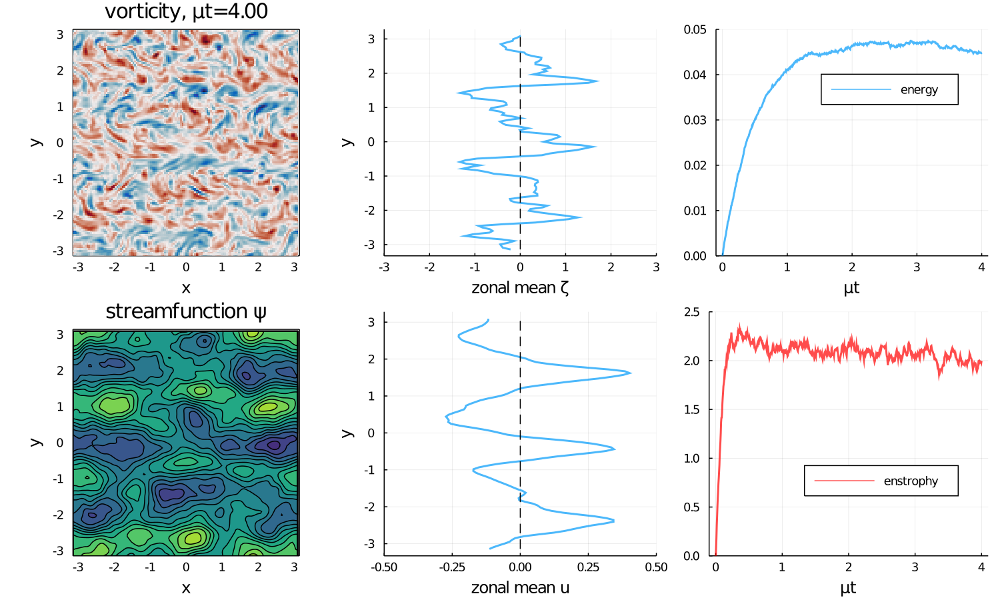

# Summary

FourierFlows is great...

<!-- 
# Citations

Citations to entries in paper.bib should be in
[rMarkdown](http://rmarkdown.rstudio.com/authoring_bibliographies_and_citations.html)
format.

If you want to cite a software repository URL (e.g. something on GitHub without a preferred
citation) then you can do it with the example BibTeX entry below for @fidgit.

For a quick reference, the following citation commands can be used:
- `@author:2001`  ->  "Author et al. (2001)"
- `[@author:2001]` -> "(Author et al., 2001)"
- `[@author1:2001; @author2:2001]` -> "(Author1 et al., 2001; Author2 et al., 2002)"
# Figures

Figures can be included like this:

and referenced from text using \autoref{fig:example}.
-->

Fenced code blocks are rendered with syntax highlighting:
```julia
]add FourierFlows
```	

# Acknowledgements

We acknowledge fruitful discussions with Cesar B. Rocha and Keaton Burns.

# References
